<div align="center">

# Block Out! Clone

**A production-grade study clone of Grand Games' _Block Out! – Color Sort Puzzle_,
built solo in Unity 6.3 (URP, mobile portrait).**

Every screen is built from code. Every level is proved solvable by a search
solver before it can be merged. Every art asset was generated with AI, directed
by a style guide that was *measured* off the reference game rather than eyeballed.

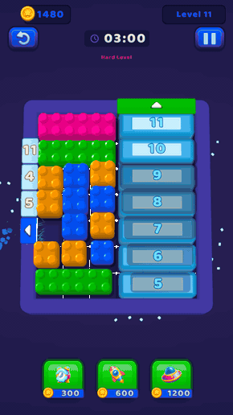

<sub>Recorded in-engine. The blocks are being dragged by the game's own input
path — see [Recording the media](#recording-the-media).</sub>

<br />


</div>

---

> [!IMPORTANT]
> **Unofficial fan project.** This repository is a personal portfolio / learning
> exercise. It is not affiliated with, endorsed by, or connected to Grand Games.
> It ships **no** original code, assets, audio, or level data from *Block Out!*.
> The goal was deliberately **85–95% resemblance, never 100%**: enough fidelity to
> prove the engineering, not a redistribution of someone else's game.
> All trademarks belong to their respective owners.

---

## Table of contents

- [The game](#the-game)
- [Screens](#screens)
- [Mechanics](#mechanics)
- [Level pipeline: JSON → editor → solver → CI](#level-pipeline-json--editor--solver--ci)
- [Architecture](#architecture)
- [The art pipeline: AI generation against a measured style guide](#the-art-pipeline-ai-generation-against-a-measured-style-guide)
- [Developer tooling](#developer-tooling)
- [GameKit — the reusable SDK that fell out of this](#gamekit--the-reusable-sdk-that-fell-out-of-this)
- [Numbers](#numbers)
- [Running it](#running-it)
- [Recording the media](#recording-the-media)
- [Status](#status)

---

## The game

You are given a board packed with coloured blocks and a frame studded with
coloured **gates**. Drag a block so it touches a gate of its own colour and it is
absorbed and leaves the board — if it fits through the opening. Clear every block
before the timer runs out.

That single rule is the whole game. Everything else is pressure applied to it:
blocks that are frozen until other blocks leave, gates that are themselves iced
shut, curtains hiding half the board, machines that keep feeding new blocks in,
and boards so tightly packed that the only way to free a piece is a 15-puzzle
style shuffle.

<table>
<tr>
<td width="50%" align="center">
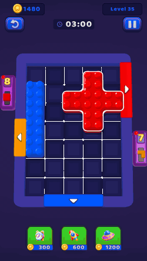<br />
<b>Generators</b><br />
<sub>Edge machines with a queue. When space frees up next to them, they push the
next block in. Their contents count as colour still in play.</sub>
</td>
<td width="50%" align="center">
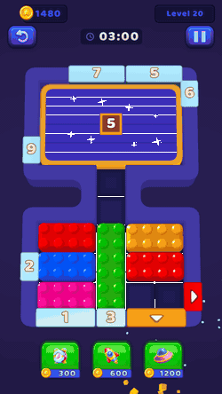<br />
<b>Curtains &amp; carved boards</b><br />
<sub>The curtain hides a region behind a counter; every absorption ticks it
down, and when it opens the blocks underneath join the puzzle. Boards are not
required to be rectangles.</sub>
</td>
</tr>
</table>

<div align="center">
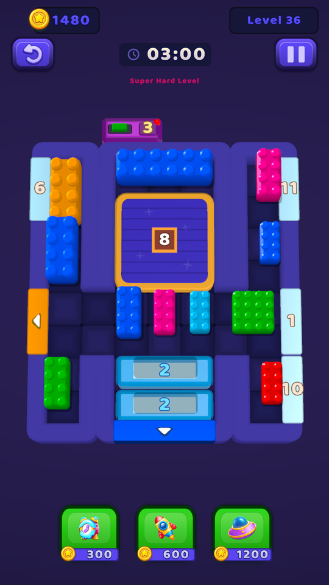

<sub><b>Level 36.</b> Gate counters on the frame, an iced gate, a curtain (the
"8" panel), a generator (top), and the three consumables along the bottom.</sub>
</div>

---

## Screens

The whole app lives in **one scene**. There is no scene load between the menu and
gameplay — `AppRoot` owns a menu root and a gameplay root and swaps them.
None of these screens is a prefab: every panel, button, ribbon and badge below is
constructed in C# at runtime.

<table>
<tr>
<td align="center">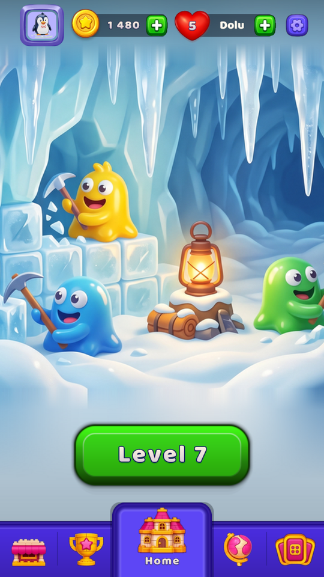<br /><sub><b>Home</b></sub></td>
<td align="center">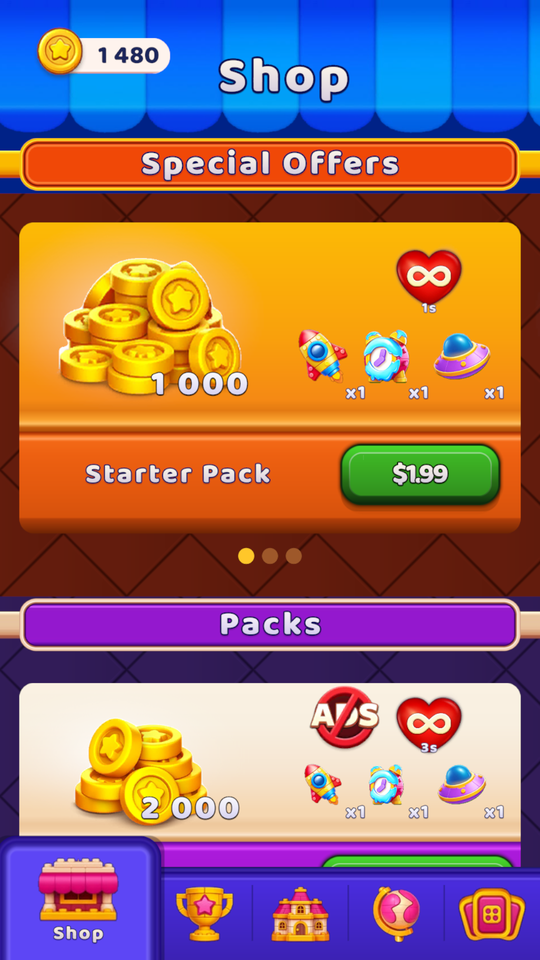<br /><sub><b>Shop</b></sub></td>
<td align="center">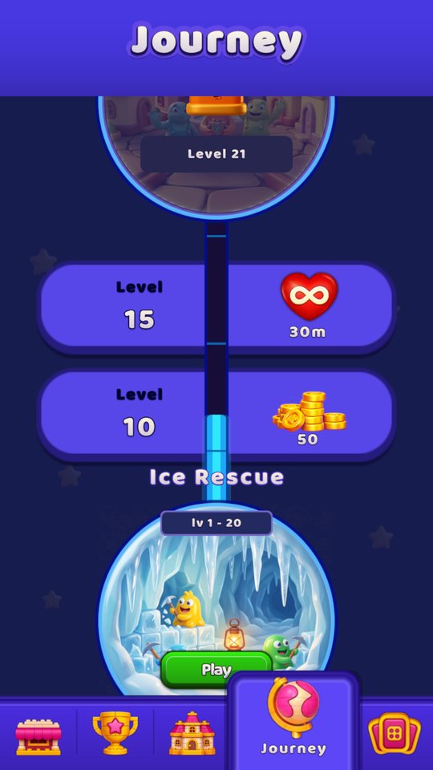<br /><sub><b>Journey</b></sub></td>
<td align="center">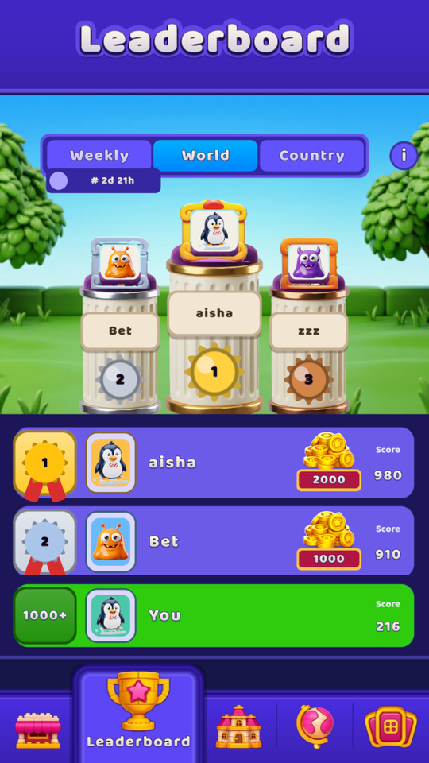<br /><sub><b>Leaderboard</b></sub></td>
<td align="center">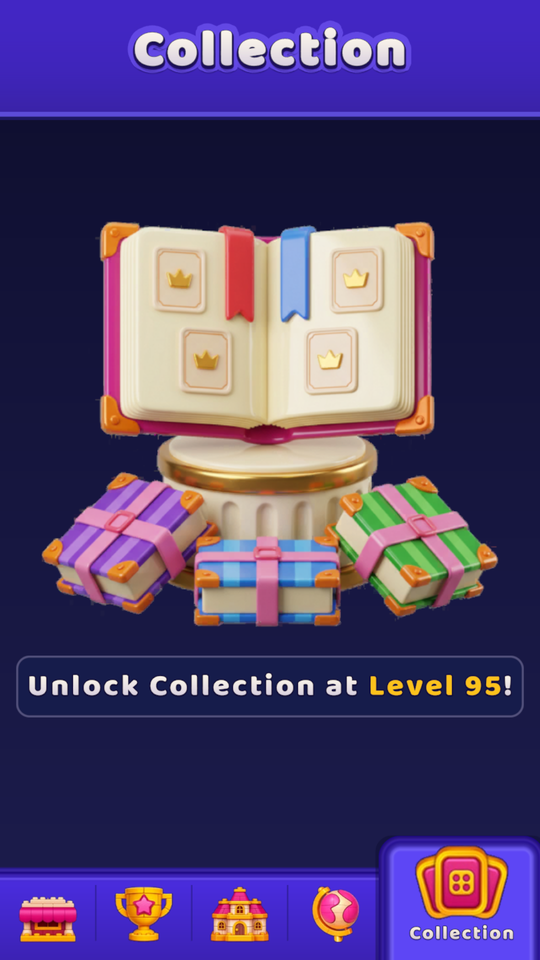<br /><sub><b>Collection</b></sub></td>
</tr>
</table>

Also in the box: daily reward calendar, level intro, pause, win celebration,
continue-offer, out-of-lives, name entry, settings, profile, boot splash, and an
on-device error overlay that replaces the console you don't have on a phone.

---

## Mechanics

| Mechanic | Rule |
|---|---|
| **Gate absorption** | A block leaves when it touches a same-colour gate **and** the gate is at least as wide as the block. Gate width caps block width — that constraint is enforced by the level validator. |
| **Layered blocks** | A block can carry a stack of colours. Contact with a matching gate peels *one* layer instead of removing the block; the next colour is now on top. |
| **Iced blocks** | Frozen: cannot be dragged. Every block that leaves the board decrements **all** ice counters by one. At zero the ice shatters. |
| **Iced gates** | The gate itself is sealed and refuses contact until its own counter reaches zero. |
| **Curtains** | Hide a region plus its contents behind a counter. Absorptions tick it down; when it opens the hidden blocks enter play. A curtained region is not movable. |
| **Generators** | Edge machines holding a queue of blocks. When the cell in front frees up, the next block is pushed in. |
| **Ghost gates** | A gate whose colour no longer exists anywhere in play (board *or* generator queues) goes ghost and stops accepting contact. |
| **Axis locks** | Some blocks may only travel on one axis. The solver honours the same restriction, so it can never call a level solvable via a move the player cannot make. |
| **Power-ups** | ⏰ freeze the timer · 🚀 delete a target block · 🛸 delete a target block. Rocket and UFO are two-stage: coins buy the item into your inventory, and it is only consumed when you pick a target — a mis-tap can be cancelled without losing the coins. |
| **Economy** | Coins, lives with a refill timer, stars, combos, daily rewards, shop packs and offers, weekly/world/country leaderboards. |

> A deliberate consequence, not an accident: rockets and UFOs delete a block
> **through the same code path as a gate absorption**, so ice and curtain
> counters advance exactly as they would have. Writing a separate "delete" path
> would have been a second place to forget those counters.

---

## Level pipeline: JSON → editor → solver → CI

Content is treated like code here. A level is a versioned JSON document, authored
in a purpose-built editor window, proved solvable by a search solver, and
re-validated in CI on every pull request that touches levels or gameplay scripts.

<div align="center">
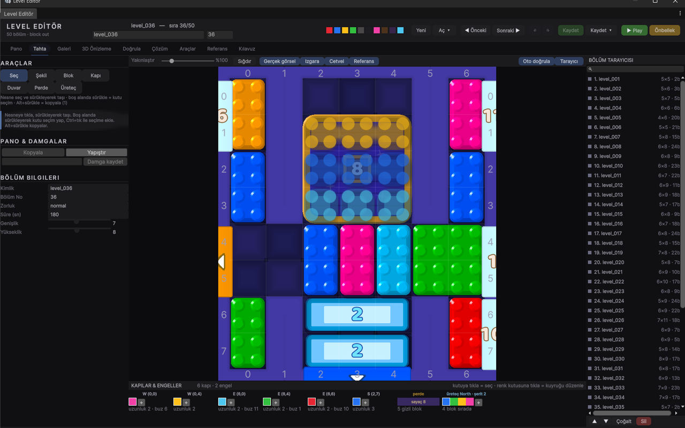
<br /><sub><b>Board tab.</b> Tools for shape, blocks, gates, walls, curtains and
generators; the inspector on the left; every level in the set on the right; the
gates &amp; obstacles of the current level along the bottom.</sub>

<br /><br />

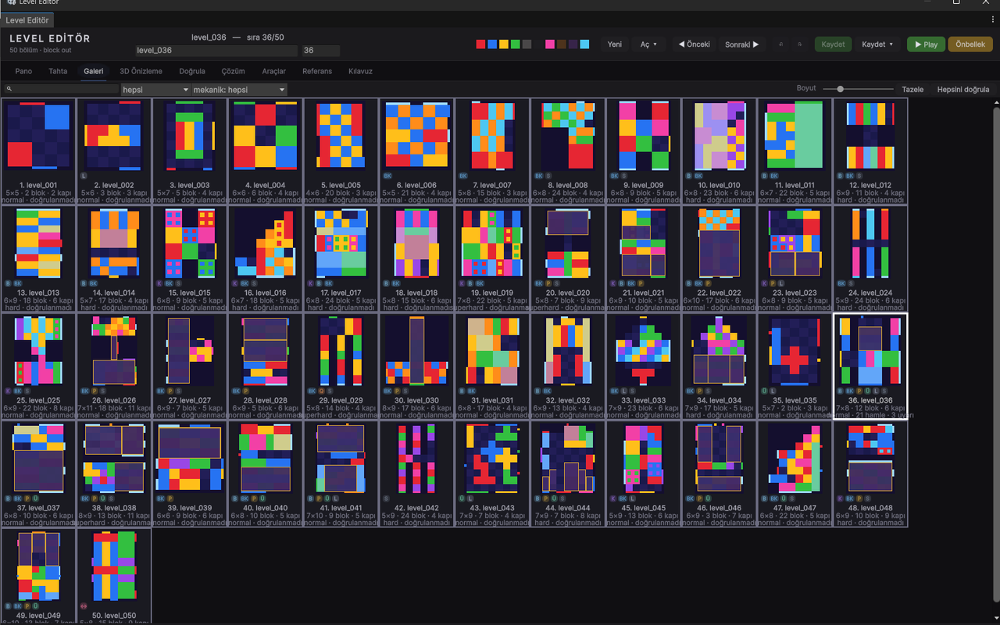
<br /><sub><b>Gallery tab.</b> All 50 levels rendered straight from their JSON,
each tagged with the mechanics it uses and its validation state — the whole
set's health on one page.</sub>
</div>

<details>
<summary><b>The level format</b> (click to expand)</summary>

```jsonc
{
  "version": 1,
  "id": "level_005",
  "displayNumber": 5,
  "difficulty": "normal",
  "timeSeconds": 180,
  "board": { "width": 4, "height": 6, "rows": ["XXXX", "XXXX", "…"], "walls": [] },
  "blocks": [
    { "x": 3, "y": 0, "w": 1, "h": 3, "layers": ["red"] },
    { "x": 0, "y": 0, "layers": ["blue"] }
  ],
  "gates": [
    { "x": 0, "y": 0, "side": "W", "length": 3, "colors": ["red"] }
  ],
  "obstacles": []
}
```

Blocks are polyominoes, not just rectangles — `rows`/`walls` carve the board
shape, and `obstacles` carries curtains and generators. A migration pass
(`LevelMigration`) upgrades older documents on load, so old level files never
become unreadable when the schema moves.

</details>

<details>
<summary><b>The editor window</b> (click to expand)</summary>

Nine tabs, one shell. The split exists because authoring a level is four
different jobs, and each wants a different layout:

| Tab | Job |
|---|---|
| **Board** | Draw one level — wide canvas, narrow inspector. Tools for shape, blocks, gates, walls, curtains and generators. |
| **Gallery** | See the whole set — a page of thumbnails rendered from the JSON. |
| **Validate** | See the health of the set — a sortable list of every level's errors and warnings. |
| **Solution** | Understand a level — play the solver's moves back one at a time on the board. |
| **Preview / Reference / Tools / Guide / Dashboard** | Camera-accurate preview, reference-frame overlay, batch operations, docs. |

It edits the game's own `LevelData` DTOs directly — there is no separate editor
model that can drift out of sync with what the game loads.

</details>

<details>
<summary><b>The solver</b> (click to expand)</summary>

`LevelSolver` answers "is this level actually finishable?" in two escalating
stages, because the cheap question and the expensive question are different
questions:

1. **Per-block reachability.** For each block, breadth-first search over the
   positions it can slide to (using the game's own `DragSolver`, its collision
   epsilon and its axis locks), looking for a spot where a gate would accept it.
   Cheap, and enough for most boards.
2. **Whole-board shuffle search.** When *no* block can reach a gate on its own —
   normal on the reference game's near-full boards — the search escalates to the
   state space of the entire board, 15-puzzle style, with a node budget and a
   focused heuristic ("get *this* block to *its* gate", because a global "nearest
   gate" heuristic flattens out at 20+ blocks and degenerates into blind BFS).

It reports more than a yes/no. It returns the move list, how many options the
player had at each step, how many steps were **forced** (exactly one legal move),
the average branching factor, and — crucially — an `Inconclusive` flag when the
budget ran out. *"Locked"* and *"I couldn't find it"* are different answers and
the tool says which one it means, because a false alarm here would push a
designer to break a level that was fine.

<div align="center">
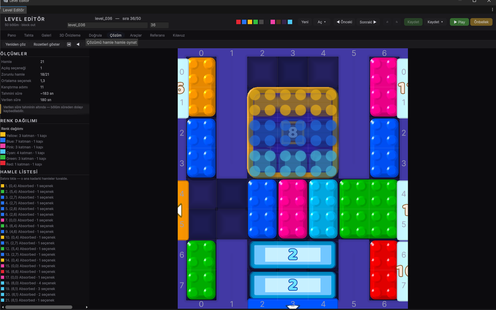
<br /><sub><b>Solution tab, level 36.</b> 21 moves · <b>1</b> opening option ·
<b>18 of 21 moves forced</b> · average branching 1.3 · 11 shuffle steps · solve
time estimated at ~183s against a 180s budget — so the tool flags that the level
is losable on time alone. This is the readout the design pass is currently
working from.</sub>
</div>

</details>

<details>
<summary><b>CI</b> (click to expand)</summary>

[`.github/workflows/validate-levels.yml`](.github/workflows/validate-levels.yml)
runs `LevelValidationTool.ValidateAllBatch` in Unity batch mode on every PR that
touches `Assets/_Project/Levels/**` or `Assets/_Project/Scripts/**`. An unsolvable
level cannot reach `main`. The job skips itself (with a warning, not a failure)
when no Unity license secret is configured, so forks aren't blocked.

</details>

---

## Architecture

```
Assets/
├── _Project/Scripts/
│   ├── Core/       ← pure model + algorithms, no MonoBehaviours
│   │                 LevelModel · BlockModel · GateModel · Obstacles
│   │                 DragSolver (sliding-collision) · LevelSolver · LevelMigration
│   ├── Runtime/    ← the game
│   │                 Board/  BoardBuilder · DragController · GateSystem · ObstacleSystem
│   │                 Flow/   AppRoot · AppRouter · GameSession · PowerUpSystem · LevelTimer
│   │                 UI/     every screen, built in code · MenuSprites (procedural art)
│   │                 View/   block/gate/curtain/generator views · FX
│   └── Editor/     ← tools: level editor, capture tools, build & asset pipeline
└── GameKit/        ← game-agnostic kit: app shell, meta layer, UI toolkit, services
```

Five assembly definitions (`BlockOut.Core`, `BlockOut.Runtime`, `BlockOut.Editor`,
`GameKit.Runtime`, `GameKit.Editor`) keep the dependency arrows one-way and keep
compile times sane.

**Decisions worth calling out:**

- **Model / view separation is real, not decorative.** `Core` has no
  `MonoBehaviour` and no scene dependency, which is exactly why the solver can
  run 50 levels headlessly in a CI container and why the editor can render a
  board preview without entering play mode.
- **Systems announce, they don't reach.** `PowerUpSystem` raises "a power-up
  fired"; `AudioService` decides what that sounds like. Changing the rocket SFX
  never means touching gameplay code.
- **UI is code, not prefabs.** No prefab merge conflicts, no scene diffs nobody
  can read, and a screen can be constructed and screenshotted from an editor
  script without a play session. A live layout window (`Ctrl+Shift+U`) lets you
  drag things around in the editor and saves **only the deltas** into an asset,
  so hand-tuning never fights the code.
- **Procedural sprites.** `UiSprites` + `MenuSprites` (~3,000 lines) draw rounded
  panels, capsules, rings, ribbons, badges and glows at runtime. The game had a
  complete, working UI before a single PNG existed.
- **~960 `DERS (…)` ("lesson") comment blocks.** Every one records a bug that
  actually happened: why the code is shaped this way and why the obvious
  alternative was wrong. They are the most expensive thing in the repository.

> **A note on language:** the code comments, the design docs under `docs/`, and
> the SDK documentation are written in **Turkish**. The code itself — types,
> members, file layout — is English. This README is the English entry point.

---

## The art pipeline: AI generation against a measured style guide

The reference game's assets were never available, and were never wanted. What was
needed was its **art direction**, reconstructed accurately enough that separately
generated pieces would look like one coherent set.

**1 · Measure the target, don't eyeball it.**
Palette and geometry were pulled from lossless 1320×2868 App Store PNGs, not from
compressed video — a lesson learned the hard way after 720p footage produced
purples that were simply wrong. The studio's sister title (*Magic Sort!*, Android,
Unity + IL2CPP) was unpacked to inspect the studio's actual UI kit — 5,773
assets. That teardown answered the font question negatively but usefully: the two
games do **not** share a typeface, so the search moved to measurement. The string
`1550` was isolated from an iPad screenshot (thresholding on *colour*, not
brightness, to drop the gold coin behind it), measured at 112×36 px, and compared
against ten candidates normalised to the same weight and stroke — Baloo 2 came
closest at an aspect ratio 0.034 off, and that is what ships. The palette work
produced a hex table in [`docs/art-prompts.md`](docs/art-prompts.md):

| Role | Value | | Role | Value |
|---|---|---|---|---|
| Game background | `#1A173A` | | Card purple | `#9F13CB` |
| Menu background | `#3B1B64` | | CTA green (face) | `#2DCC0C` |
| Board frame | `#5A52C8` | | CTA green (edge) | `#18A714` |
| Tab bar | `#3F2FCD` | | Coin gold | `#F0C000` |

**2 · Write the style DNA once, append it to every prompt.**
The reference UI is *3D-rendered glossy plastic*, not flat vector: one soft key
light from the upper left, a hard specular highlight on top, thick rounded edges,
no outlines on the 3D pieces, candy saturation. That description became a fixed
suffix appended to **every** asset prompt. Consistency across a hundred
separately generated icons comes from that shared suffix, not from luck.

**3 · Constrain the output so it can be used as a game asset.**
1024×1024, transparent background, single centred object, ~8% margin, and
**no baked text or numbers** — every number in the game is TextMeshPro on top, so
the same coin sprite serves `50` and `2 000`.

**4 · Automate the boring half.** Python under [`tools/`](tools/):
`cutout.py` (trim + alpha), `import_art.py` / `import_audio.py` (drop into the
project with correct import settings), `make_icon.py` and `make_icon_layers.py`
(app icon), `check_art.py` (audit).

<details>
<summary><b>Three traps this pipeline walked into</b> (click to expand)</summary>

- **Checkerboard blindness.** Generated images sometimes *paint* a transparency
  checkerboard. Verifying cutouts against a checkerboard background hid it inside
  five icons. Cutouts are now always checked against flat dark.
- **Adding an asset is a table edit, not a file copy.** `UiSkin` is a
  ScriptableObject lookup; a PNG that exists on disk but isn't registered
  resolves to `null` and draws as a white box.
- **Judge a decision at the size it will be seen.** A background was picked from
  300px preview strips and turned out to have curved corners at full screen.

</details>

---

## Developer tooling

| Tool | What it does |
|---|---|
| **Hidden dev console** | Five quick taps in a top corner of the screen (or `F8` in the editor). Level jump, force win/lose, absorb one block, economy edits, input blocking. **Never a visible button** — a test button that ships is a bug. |
| **Level browser** | Editor window listing every level with its validation state. |
| **Board / UI / FX capture** | Render a level's board, or a specific screen's canvas, to PNG **without entering play mode** — so a visual fix can be *seen* rather than assumed. Built after the sixth round of "I think that's right" turned out not to be. |
| **README capture** | The tool that produced the media on this page; see below. |
| **Android build tool** | One-button APK with manifest patching and icon generation. |
| **Device error overlay** | Prints uncaught exceptions on the device screen — the console you don't get on a phone. Explicitly disabled before release. |
| **UI overflow audit** | Scans built screens for text that overflows its box. |

---

## GameKit — the reusable SDK that fell out of this

Everything in this project that is *not* Block Out! was extracted into
[`SDK/`](SDK/): a game-agnostic Unity package (89 files, ~24,900 lines, verified
to compile clean with Roslyn) covering the single-scene app shell, the meta layer
(save, progress, lives, daily reward, purchases), the meta screens, the code-first
UI toolkit, the procedural sprite generator, the services (audio, haptics, ads,
analytics) and the editor tooling.

The idea: for the next mobile clone, the only thing left to write is the
gameplay. Start at [`SDK/README.md`](SDK/README.md).

---

## Numbers

| | |
|---|---|
| Unity / pipeline | 6000.3.10f1 · URP 17.3 · mobile portrait |
| C# | **192 files · 61,469 lines** |
| ↳ Core (model + solvers) | 18 files · 2,711 lines |
| ↳ Runtime (game) | 76 files · 35,934 lines |
| ↳ Editor (tools) | 44 files · 13,369 lines |
| ↳ GameKit (SDK source) | 35 files · 7,895 lines |
| Levels | 50, all solver-validated |
| UI art | 109 PNGs · 4 custom shaders |
| Audio | 32 clips |
| `DERS (…)` lesson comments | 960 |
| Commits | 251, across `M0 → M6` milestone branches |

Third-party runtime dependencies: PrimeTween, Newtonsoft.Json, Unity Input
System, TextMeshPro. That's it.

---

## Running it

```bash
git clone https://github.com/furkanblci/BlockOut-Clone.git
```

1. Open with **Unity 6000.3.10f1** (URP template dependencies resolve from
   `Packages/manifest.json`).
2. Open `Assets/_Project/Scenes/Boot.unity` and press Play. The project
   self-bootstraps — `ProjectBootstrap` builds anything the scene is missing.
3. `Tools ▸ Block Out ▸ Game View'ı Telefon Boyutuna Ayarla (1080x1920)` sets the
   Game view to the target portrait aspect in one click.

Everything lives under the `Tools ▸ Block Out` menu (labels are Turkish):

| Menu | |
|---|---|
| `Level Editör` | the level editor window |
| `Bölüm Tarayıcı` (`Ctrl+Shift+L`) | level browser |
| `Tüm Bölümleri Doğrula` | run the validator + solver over all 50 levels |
| `Arayüz Tasarımı` (`Ctrl+Shift+U`) | live UI layout editor |
| `Görünüm Ayarları` | live block/board visual tuning |
| `Android: APK Derle` | one-button build (debug / release) |
| `Kurulumu Şimdi Çalıştır` | re-run the project bootstrap |

---

## Recording the media

The GIFs above are not screen recordings. `ReadmeCaptureTool` is an editor tool
that drives the game and captures it frame-by-frame:

- **The frames** come from `ScreenCapture.CaptureScreenshotIntoRenderTexture` at
  the end of frame, with `Time.captureFramerate` set — so game time advances by
  exactly 1/fps per frame regardless of how slow PNG encoding is, and the motion
  in the GIF is smooth instead of stuttering.
- **The moves** are played by the game itself. The tool runs the same
  reachability search the solver uses to find a block that can reach a gate,
  reconstructs the path, and then **synthesises pointer events** into
  `PointerInputService`. The blocks you see are being dragged through
  `DragController`, `DragSolver` and `GateSystem` exactly as a finger would drive
  them — collision sliding, ice shattering, gate counters, combo and all.

Which is the point: if the recording had teleported blocks into place, it would
have proved nothing about the game.

---

## Status

Playable end to end: 50 levels, full meta loop, Android build. Current work is
level design tuning — an early pass found that 44 of 50 levels open with exactly
one legal move, which is *solvable* but too tight to be enjoyable, so the set is
being loosened. Haptics still need verification on a physical device.

Development ran as `M0 → M6` milestone branches with pull requests
(`m0-project-skeleton`, `m1-playable-core`, `m2-obstacles`, `m3-level-editor`,
`m4-polish`, `m5-meta`, `m6-performance`).

---

<div align="center">
<sub>Built as a portfolio piece. Not affiliated with Grand Games.<br />
<i>Block Out! – Color Sort Puzzle</i> and its trademarks belong to their owners.</sub>
</div>
